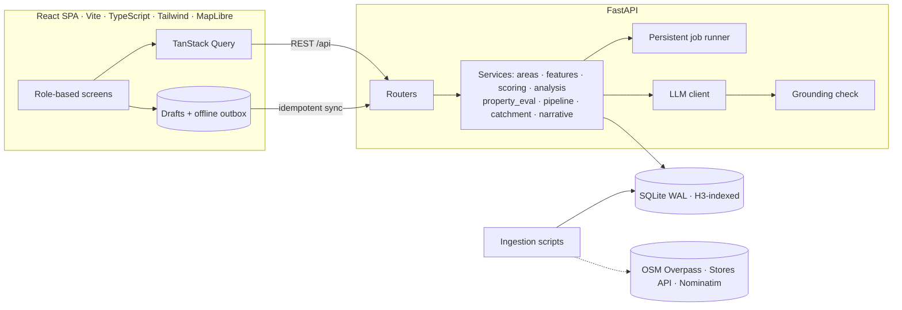
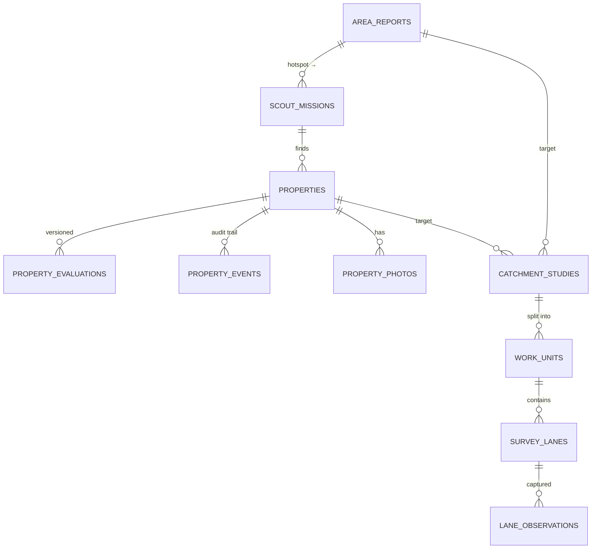

# Savo SiteScout

SiteScout is my take on Savomart's expansion problem for Chennai. It follows a new store from "which area should we look at?" to "which property?" to "is the catchment really there?", and it keeps the BD team and the survey team working in the same loop.

- Repository: https://github.com/DurgaNandhini26/savomart-fullstack-hackathon-2026
- Video demo: https://drive.google.com/file/d/17kISXg27I6I-9XjC6e8dePtrjFIbxydl/view?usp=sharing
- AI chat sessions: [ai-sessions/](ai-sessions/)

Each of the four personas gets a view built around their job:

| Persona | What they do in SiteScout |
|---|---|
| BD Manager | Explores Chennai on a map (with a city-wide opportunity layer), runs an Area Fitness Report, sends executives to the suggested hotspots, decides on properties from a one-screen summary, requests catchment studies and asks the AI analyst questions. |
| BD Executive (phone) | Sees their missions, navigates there, and onboards a property in four steps: pin, details, photos, and a duplicate/sanity check. It works offline. |
| Survey Manager | Receives study requests, splits each one into fair, non-overlapping sectors, assigns them and tracks progress. |
| Survey Executive (phone) | Walks their sector lane by lane and records what they see. Drafts save automatically and everything syncs when the signal comes back. |

---

## 1. Running it locally

You need Python 3.11+ and Node 20+. There's no database server to install and no API key is required.

```bash
# backend
cd backend
python -m venv .venv
.venv\Scripts\activate              # macOS/Linux: source .venv/bin/activate
pip install -r requirements.txt
python -m scripts.bootstrap         # loads Chennai data, demo users and a demo scenario (~1 min)
uvicorn app.main:app --reload       # API on :8000, docs at /docs

# frontend, in a second terminal
cd frontend
npm install
npm run dev                         # open http://localhost:5173
```

If you prefer Docker, `docker compose up --build` runs the API and the UI together on http://localhost:8000.

A few optional things:
- Copy `backend/.env.example` to `backend/.env` to add an LLM key (see section 6) or the Stores API token.
- `python -m scripts.bootstrap --fresh` resets everything back to the demo state.
- `python -m scripts.bootstrap --live` re-downloads all the public data from source instead of using the committed snapshot.

## 2. Demo logins

The login page has one-tap cards for each persona. Every account's password is `savo@123`.

| Username | Role |
|---|---|
| `priya` | BD Manager |
| `arun`, `karthik` | BD Executive |
| `lakshmi` | Survey Manager |
| `suresh`, `divya`, `mani` | Survey Executive |

The demo data isn't inserted straight into the database. The bootstrap script logs in as each persona and uses the real API, so every evaluation, history entry and notification you see was produced by the app itself. You'll find:
- 6 area reports and 6 scouting missions;
- 8 properties at different pipeline stages;
- 4 catchment studies: CS-001 is complete, CS-002 was answered entirely by reusing CS-001, CS-003 is half surveyed, and CS-004 is waiting for the survey manager.

A good way to walk through it:
1. Log in as priya, open Explore, search "Velachery" or "600042" (or tap a few hexagons in Grid cells) and run a virtual analysis. From the report, send an executive to a hotspot.
2. Log in as arun, open the mission and tap "Add property here". Once you submit, it gets scored within a few seconds.
3. Back as priya, open the property from the Pipeline, shortlist it and request a catchment study. The preview shows how much of the area was already surveyed.
4. As lakshmi, open CS-004, split it into sectors and assign the surveyors.
5. As suresh, open CS-003 and record a lane. Try it with the network turned off.
6. As priya, open PR-0001. Its latest evaluation is backed by the CS-001 survey. Print the decision pack, then ask the Analyst to "compare Velachery and Tambaram".

## 3. Architecture



Some notes on how it hangs together:
- Area analyses and property evaluations run as background jobs. Each job is saved in the database with a list of steps, and the UI shows those steps ticking off live. If a job fails you can retry it, and if the server restarts mid-job it picks the job up again.
- Access control lives on the server, not just in the UI. Every endpoint checks the user's role, executives only see their own missions and properties, surveyors can only write to lanes assigned to them, and only managers can move a property between stages.
- Errors are meant to be readable. Bad input comes back as a 422 that names the field, conflicts such as duplicates come back as 409 with a plain explanation, and unexpected errors never leak a stack trace. In the UI, each screen has its own error boundary, so one broken screen doesn't blank the whole app.

## 4. Data model

Everything that has a location also stores H3 hexagon IDs, at resolution 9 (about 0.1 km²) and resolution 8 (about 0.74 km²). I leaned on this one grid for three different things:
- as the spatial index: to find things near a point, I look up the hexagons in a ring around it and then filter by exact distance;
- as the grid the manager taps on the map to pick an area;
- as the unit of survey coverage. Hexagons never overlap, so "has this already been surveyed?" becomes simple set arithmetic.



| Tables | What they hold |
|---|---|
| `pois`, `roads`, `places`, `stores` | The public data. Roads are cut into one piece per hexagon. |
| `cell_stats`, `opportunity_cells`, `baseline_meta` | Per-hexagon features, the city-wide score distributions used for percentiles, and the opportunity map. |
| `data_snapshots` | One row per data import (source, when it was fetched, OSM timestamp, row count). Every report and evaluation records which snapshot it used. |
| `area_reports` | The chosen hexagons, the score and how it was built, the area profile, hotspots, the written summary and, later, survey results. |
| `properties`, `property_evaluations`, `property_events` | What the executive captured (plus any data-quality warnings), a versioned history of evaluations with the reason for each, and a permanent log of who did what. |
| `catchment_studies`, `work_units`, `survey_lanes`, `lane_observations` | What was requested vs what still needs surveying, which earlier studies were reused, the sectors, the lanes and the recorded observations. |
| `jobs`, `notifications`, `users` | Background jobs, the activity feed and the demo users. |

## 5. Where the data comes from

| Source | What I used it for | How I processed it |
|---|---|---|
| OpenStreetMap via Overpass (snapshot of 28 Sept 2026) | 12,869 points of interest, 113,769 roads, 389,056 buildings, 850 localities | Downloaded in tiles over the Chennai metro area, with retries across several Overpass servers and a local cache. Shops and amenities are grouped into 17 categories, roads are split per hexagon (166k pieces), and buildings are counted per hexagon by type. |
| Savomart Stores API | 74 stores, 11 of them in Chennai | Called with a plain GET and the `X-cron-token` header, as in the organisers' corrected command. Used for distance to existing stores and cannibalisation. A copy lives in `data/seed/stores.json`. |
| Nominatim | 126 pincode centres, address lookup for field pins, locality aliases like "T Nagar" | Limited to one request per second and cached. I tried the OGD pincode API first, but it kept timing out. |
| Census of India 2011 | Population total for calibration (about 9.0 million for the study area) and household size (about 4) | Used for the population estimate described in section 6. |
| Mock data, labelled "MOCK" in the app | Rent benchmark per sq ft | I couldn't find any open rent data for Chennai. |

The processed data is committed as `backend/data/seed/public_data.sqlite.gz` (about 12 MB), because the public Overpass servers were often overloaded and I didn't want the setup to depend on them. Map data © OpenStreetMap contributors (ODbL); basemap tiles by OpenFreeMap.

Two limitations are worth knowing about, and the app mentions both:
- OpenStreetMap misses most small kirana stores, so the mapped competition is only a relative signal. The field survey is the real check.
- Building coverage in OpenStreetMap is uneven, so every report shows a confidence level based on how complete the data is for that area.

## 6. How scoring and the AI work

Population. There's no recent population data per neighbourhood, so I spread the Census total across hexagons in proportion to two signals, half each: residential buildings (buildings of unknown type count as 0.7) and residential street length. Streets are almost fully mapped in OpenStreetMap while buildings aren't, so combining them is more reliable than using either on its own. In the demo, the CS-001 survey came within 1% of the estimated number of households.

Area fit. An area is scored on six pillars. Each pillar is a percentile against roughly 1,470 populated neighbourhoods across Chennai, so a 72 simply means "better than 72% of the city on this measure".

| Pillar | Weight | Based on |
|---|---|---|
| Resident demand | 25% | residents per km² |
| Competition gap | 25% | residents per grocery outlet, and supermarkets per 10k people (fewer is better) |
| Daily footfall | 15% | schools, clinics, transit stops, places of worship, offices and markets per km² |
| Spending power (a proxy) | 10% | banks, restaurants and malls per km², and the share of apartments |
| Network fit | 15% | distance to the nearest Savomart. Under 1 km would steal from an existing store, and 2.5–5 km is the sweet spot |
| Access | 10% | road density and main roads |

The report shows the full calculation with the real numbers, lists every indicator with its source, and gives a confidence level that depends on data quality rather than on the score. Scores of 70 and up are a strong fit, 55 and up promising, 40 and up marginal, and anything lower is weak.

Hotspots. Inside the chosen area, every populated small hexagon is scored on what's within a ~750 m walk: `0.35 × demand + 0.25 × competition gap + 0.15 × footfall + 0.15 × road visibility + 0.10 × network fit`. The best five that are at least 800 m apart are suggested, each with the reasons behind it.

Property evaluation. A property is scored on four things:
- the catchment (40%): public data within 800 m, swapped for the survey results once a catchment study covers it;
- the site (25%): size, frontage, floor, road, parking, power and truck access;
- the commercials (20%): rent against the benchmark, deposit and lease length;
- the network (15%): distance to the nearest Savomart.

Some problems are deal-breakers no matter how good the area is: a first-floor unit, less than 800 sq ft, less than 1.5 km from an existing store, or rent more than 20% over the benchmark. Any of these caps the score at 64. A score of 68 or more is a "Go", 50 or more is "Consider", and anything below is "No-go".

Bad field input. Pins outside the Chennai region are rejected outright. Softer issues become warnings for the manager: the pin is more than 250 m from where the phone was, the GPS was inaccurate, rent or area is missing, or the rent per sq ft looks like the wrong unit (annual instead of monthly, for example). If another property already exists within 40 m, the executive has to confirm it's a different unit, and resubmitting after a dropped connection never creates a duplicate.

Evaluations keep their history. A new version is created when the details are edited, when the manager asks for one, or when a catchment study finishes. The page shows how the score moved (for example `v1: 94 → v2: 84`) and which survey caused it.

Pipeline stages. A property moves from `submitted` to `shortlisted`, then to a site visit or catchment study, then `negotiation`, and finally `approved`. The manager can also ask the executive for more information (they answer by editing the property), or mark it rejected, on hold or a duplicate. Every move needs a note, rejections need a reason, and only managers can move a property.

How the AI is kept honest. The language model never calculates anything. It only explains numbers that the scoring code has already worked out.
- Every number the model writes is checked against those facts. Rounding is fine (48,213 can become 48k, 0.42 can become 42%), but if even one number can't be traced back, the AI text is thrown away and a plain template is shown instead.
- The page always tells you which one you're reading, e.g. "AI-written · 14 figures verified" or "Template".
- The Analyst chat works the same way: it first works out which areas, pincodes, properties or studies you're asking about, calculates their facts with the same code, and only then lets the model phrase the answer.
- The provider is set in `.env`: Anthropic, any OpenAI-compatible service (OpenAI, Groq, OpenRouter, Ollama), or none. With none, the default, everything still works using the templates.
- I deliberately kept AI out of scoring, hotspot ranking, survey splitting and reuse decisions so those results are always reproducible.

## 7. Catchment studies

Reusing earlier surveys. A hexagon counts as already covered if a study that included it finished within the last 180 days or is still running. If at least 80% of a new catchment is covered, no new fieldwork is created and the study simply reuses the earlier results. Otherwise only the missing hexagons are surveyed. Both limits can be changed in the config.

Splitting the work fairly. The streets in the catchment are weighted by length, since that's what takes time to walk. They're sorted by compass direction from the centre and cut into equal slices of total street length, like slices of a pie. The slices never overlap, and each one starts at the centre so nobody has a long walk to their first lane. By default there's one slice per available surveyor, assuming about 4 km of lanes per person per day.

What gets recorded on each lane: approximate number of households, the type of housing, a rough economic class (A to D), how occupied it looks, kirana and supermarket counts, competitor brands seen, how busy the street is, and vehicle access. If a lane can't be entered, the surveyor can mark it as inaccessible. Everything is designed for one-thumb use on a phone.

Weak network. The assignment is saved on the phone, drafts save automatically once you start typing, and finished lanes wait in a local outbox until there's a connection. The server recognises each submission by a unique ID, so sending the same lane twice never counts it twice.

When the survey is done (or the survey manager closes it at 60% coverage or more), the results are rolled up. The roll-up gives:
- households, with unsurveyed lanes estimated from their length;
- outlets and households per outlet;
- the housing and economic mix, competitor brands and footfall;
- how the survey compares with the model's estimate.

These results are attached to the area report, and any affected properties are re-evaluated.

## 8. Technology choices and trade-offs

| Choice | Why I picked it |
|---|---|
| FastAPI, Pydantic, SQLAlchemy 2 | Typed validation, automatic API docs, and a simple way to run background jobs in the same process. |
| SQLite with H3 and Shapely, instead of PostGIS | Every location query here is either "these hexagons" or "within this distance", and H3 plus a distance check answers both exactly. It also means reviewers can run the project with one command and no database server. Moving to PostGIS later would mostly mean changing the queries in `services/features.py`. |
| React, Vite, TypeScript, TanStack Query | Type-safe screens, plus caching and polling for the background jobs. |
| MapLibre GL with OpenFreeMap tiles | Open-source maps with a free basemap that needs no API key, and it stays smooth with thousands of hexagons. |
| Tailwind v4 | Savomart's purple (#782B90) and yellow (#FFF200) set up once as theme colours, with a mobile-first layout. |

A few other decisions I made on purpose:
- Scoring is rule-based and uses percentiles rather than machine learning. There's no store performance data to learn from yet, and a manager needs to see why a score is what it is. Once sales data exists, these same pillars are what I'd train on.
- Pincode and locality boundaries are approximate: each one is the set of hexagons closest to its centre. The app says so.
- Job progress uses polling rather than websockets, which copes better with patchy mobile networks.
- Login is deliberately simple, as the brief allows: seeded demo users and a persona switcher. The role checks behind it are real.

## 9. Known issues and what I'd do next

- Rents are mock data. Next I'd plug in real lease comparables.
- Population is calibrated to one 2011 total. I'd calibrate per ward with newer estimates.
- Pincode areas are approximations. I'd switch to the official OGD boundary files.
- There's no service worker yet, so the app needs to load once online before the offline features work.
- Survey sectors are compass slices. Very long, narrow catchments would split better along the street network itself.
- The job runner is a single process with no rate limiting. That's fine for a team, but it would need a proper queue at scale.
- Catchments use straight-line distance. Drive-time catchments (via OSRM) would be more realistic.

## 10. Tests

```bash
cd backend && python -m pytest -q     # 14 tests
cd frontend && npm run build          # type check + production build
```

The unit tests check that:
- scores behave sensibly and always equal the weighted sum of the pillars;
- the grounding check accepts rounding but rejects invented numbers;
- the survey split covers every street exactly once, in balanced, connected slices.

A larger flow test runs the whole M1 → M2 → M3 loop through the API on a small synthetic city. It covers:
- role checks and background jobs;
- rejected pins, data warnings, safe resubmits and duplicate detection;
- pipeline rules;
- survey splitting and surveyors being blocked from other people's lanes;
- offline re-sync, the automatic roll-up, re-evaluation with survey data, and full reuse of an earlier study.

GitHub Actions runs the tests, a full fresh bootstrap and the frontend build on every push.

## 11. Working with Claude

I built this with Claude Code (Anthropic) in the Claude desktop app. I gave it the brief and directed the work through the conversation, and it wrote the code, ran it, and tested every persona's screens in a built-in browser. The full exported session is in [ai-sessions/](ai-sessions/).

These were the main prompts I gave, in order, and what came out of each:

| What I asked | What happened |
|---|---|
| "I want to do this whole project … the project should satisfy all the requirements." | Claude read the brief, tested the real data sources (the Stores API, Overpass, Nominatim and the OGD pincode API) and chose SQLite + H3 because Docker wasn't available. It then built the backend, frontend and tests for M1–M3, clicking through each flow in the browser and fixing the bugs it found along the way. |
| "How to run this and see, before that check once everything works fine." | It cleared out stale dev servers, ran the tests and the type check, called every main API endpoint as each persona, and ran a fresh area analysis. |
| "Make sure the readme is proper … it will be evaluated as well." | The README was rewritten for reviewers. Local tooling files were removed from the repo, and an unused setting that the README had described was deleted. |
| "Did it complete every milestone? How to check?" | It mapped each line of M1–M3 to the screen where you can see it, and was upfront about what's approximate or synthetic. |
| The organisers' correction to the Stores API command | The code was already calling the API with GET, so only the README needed a note. |
| "Render or Vercel?" | Render: the app needs background jobs, a database file and uploaded photos, which Vercel's serverless functions can't keep. |
| "In mobile view … values are out of the grid." | It checked every screen for all four personas at phone width with an automated overflow scan, then fixed the Compare page, the decision pack, the property form and the data tables. |
| Update my git identity and make this README sound more natural | This version. |

Along the way I checked the app myself, reported the mobile layout problems I spotted, and passed on the organisers' API correction.

## 12. Project layout

```
backend/
  app/            main · config · db · models · geo · auth
    services/     areas · features · scoring · analysis · property_eval · pipeline · catchment · narrative · jobs
    routers/      core · reports · properties · studies · assistant
    llm/          provider client · grounding check
  scripts/        bootstrap · ingest_* · build_baseline · snapshot · demo_scenario
  data/seed/      committed public-data snapshot
  tests/
frontend/src/
  pages/          Explore · ReportDetail · Pipeline · PropertyDetail · NewProperty · StudyDetail · SurveyUnit · Assistant …
  components/     Map · Layout · Modals · PropertyFields · ui
  lib/            api · auth · offline (drafts, outbox, photo compression)
ai-sessions/      exported Claude Code session
```

A note for Windows: if Smart App Control blocks SQLAlchemy after installing ("An Application Control policy has blocked this file"), install its pure-Python version instead with `pip download sqlalchemy --only-binary=:all: --platform any --no-deps -d w && pip install --force-reinstall --no-deps w/*.whl`.
