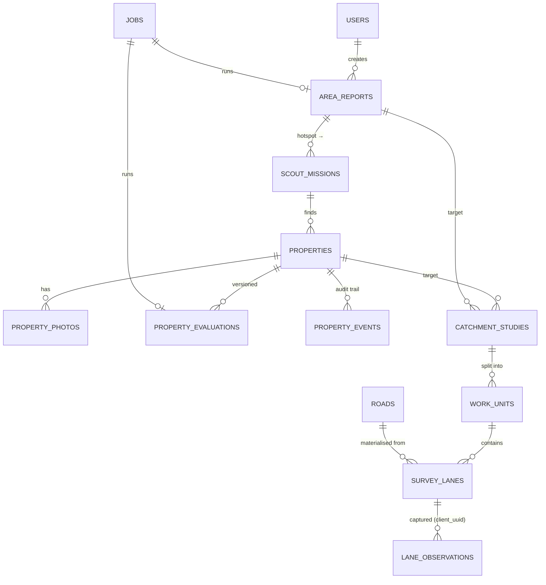

# Savo SiteScout — expansion intelligence for Savomart Chennai

SiteScout takes a new store from **"which area?"** → **"which property?"** → **"is the catchment right?"** in one loop shared by four teams:

| Persona | What SiteScout gives them |
|---|---|
| **BD Manager** | Explore any part of Chennai on a map, get an explainable *Area Fitness Report* with "scout here first" hotspots, send executives on missions, decide on properties in 30 seconds, request catchment studies, ask an AI analyst grounded in the data. |
| **BD Executive** | A phone-first mission list, navigation to hotspots, and a 4-step onboarding flow (GPS pin → details → camera photos → duplicate / sanity check) that works offline. |
| **Survey Manager** | Incoming study requests, one-click fair split of a catchment into non-overlapping sectors of equal lane-km, assignment, live progress. |
| **Survey Executive** | Their sector on a map, lane-by-lane capture with big touch targets, auto-saved drafts and an offline outbox that syncs when signal returns. |

> 🎥 **Video demo:** _<add Google Drive link here>_ · 🌐 **Live demo:** _<add URL if deployed>_

---

## Contents
1. [Quick start](#1-quick-start) · 2. [Demo credentials & walkthrough](#2-demo-credentials--walkthrough) · 3. [Architecture](#3-architecture) · 4. [Data model](#4-data-model--schema) · 5. [Data sources & processing](#5-data-sources--processing) · 6. [Scoring](#6-how-scoring-works) · 7. [AI & grounding](#7-how-ai-is-used-and-kept-grounded) · 8. [Catchment studies (M3)](#8-catchment-studies-m3-design) · 9. [Tech choices](#9-tech--library-choices) · 10. [Decisions & trade-offs](#10-design-decisions--trade-offs) · 11. [Known issues / next steps](#11-known-issues--what-id-do-next) · 12. [Testing & CI](#12-testing--ci) · 13. [AI tools used](#13-how-ai-tools-were-used) · 14. [Project layout](#14-project-layout)

---

## 1. Quick start

**Requirements:** Python 3.11+ and Node 20+. No database server, no API keys needed.

```bash
# 1) backend
cd backend
python -m venv .venv
.venv/Scripts/activate            # Windows  (macOS/Linux: source .venv/bin/activate)
pip install -r requirements.txt
cp .env.example .env              # optional: add STORES_API_TOKEN / LLM keys
python -m scripts.bootstrap       # loads the Chennai data snapshot + demo users + demo scenario (~1 min)
uvicorn app.main:app --reload     # http://localhost:8000  (API docs at /docs)

# 2) frontend (second terminal)
cd frontend
npm install
npm run dev                       # http://localhost:5173
```

Open **http://localhost:5173** and tap a persona.

**Docker (single container, API + built UI):**
```bash
docker compose up --build         # http://localhost:8000
```

**Useful bootstrap flags**

| Command | What it does |
|---|---|
| `python -m scripts.bootstrap` | Snapshot + users + demo scenario (skips the scenario if data exists) |
| `python -m scripts.bootstrap --fresh` | Delete the DB and rebuild from scratch |
| `python -m scripts.bootstrap --no-demo` | Public data + users only, empty pipeline |
| `python -m scripts.bootstrap --live --fresh` | Re-ingest everything from Overpass / Stores API / Nominatim (slow; public Overpass is often overloaded — raw responses are cached in `data/raw/`) |
| `python -m scripts.snapshot export` | Re-export the committed snapshot after a live ingest |

**Optional LLM** (the app is fully functional without one — narratives fall back to deterministic templates). Set in `backend/.env`:
```ini
LLM_PROVIDER=anthropic   LLM_API_KEY=sk-ant-...   LLM_MODEL=claude-haiku-4-5-20251001
# or any OpenAI-compatible endpoint (OpenAI, Groq, OpenRouter, Together, Ollama, LM Studio):
LLM_PROVIDER=openai      LLM_BASE_URL=http://localhost:11434/v1   LLM_MODEL=llama3.1
```

> **Windows note:** on machines with *Smart App Control / WDAC*, SQLAlchemy's compiled Cython extension may be blocked ("An Application Control policy has blocked this file"). Install the pure-Python wheel instead:
> `pip download sqlalchemy --only-binary=:all: --platform any --no-deps -d wheels && pip install --force-reinstall --no-deps wheels/*.whl`

---

## 2. Demo credentials & walkthrough

Every account uses password **`savo@123`**; the login page also has a **one-tap persona switcher** (demo only — it's a documented stand-in for SSO).

| Username | Name | Role |
|---|---|---|
| `priya` | Priya Raman | BD Manager |
| `arun` | Arun Kumar | BD Executive |
| `karthik` | Karthik S | BD Executive |
| `lakshmi` | Lakshmi Narayanan | Survey Manager |
| `suresh` · `divya` · `mani` | Suresh M · Divya R · Mani V | Survey Executives |

The bootstrap seeds a realistic state **by driving the real API as each persona** (so every evaluation, audit event and notification is genuine): 6 area reports (Kolathur, Tambaram, Porur, Velachery, Anna Nagar + an opportunity-map pocket), 6 missions, 8 properties spread across every pipeline stage, one completed catchment study (CS-001), one study fully satisfied by **reuse** (CS-002), one half-surveyed (CS-003, Suresh has live work) and one awaiting planning (CS-004).

**Core loop to try (≈5 min)** — also the script for the video, see [`docs/demo-script.md`](docs/demo-script.md):
1. **Priya → Explore.** Toggle the opportunity layer, search `Velachery` / `600042` or switch to *Grid cells* and tap hexagons → *Run virtual analysis*. Watch the live job checklist; open the report: score ring, pillar breakdown with the formula, indicators with sources, hotspots on the map. *Send an executive* to hotspot #1.
2. **Arun (phone) → Missions → Add property here.** Drop the pin (or GPS), fill details, take a photo, review (duplicate + sanity checks), submit → auto-evaluation in seconds.
3. **Priya → Pipeline → property.** 30-second decision card; *Shortlist* (note required), *Catchment study* → preview shows reuse coverage.
4. **Lakshmi → Studies → CS-004.** Split into sectors (equal lane-km), assign surveyors. Check *Team* workload.
5. **Suresh (phone) → Assignments → CS-003.** Tap *Next lane*, record households / SEC / kiranas / brands; turn the network off — it keeps saving, then syncs.
6. **Priya → PR-0001** — evaluation v2 is *ground-truthed* by CS-001 (survey households vs model: +1%). *Decision pack* → print to PDF. **Analyst** → "compare Velachery and Tambaram".

---

## 3. Architecture

```mermaid
flowchart LR
  subgraph Browser["React SPA (Vite + TS + Tailwind + MapLibre)"]
    UI[Role-shaped screens] --> RQ[TanStack Query]
    UI --> OB[(Offline outbox\n+ drafts, localStorage)]
  end
  RQ -- REST /api --> API
  OB -- idempotent sync --> API
  subgraph Server["FastAPI"]
    API[Routers\nauth · core · reports · properties · studies · assistant] --> SVC[Services\nareas · features · scoring · analysis\nproperty_eval · pipeline · catchment · narrative]
    SVC --> JOBS[Job runner\npersistent jobs table + thread pool]
    SVC --> LLM[LLM client\nanthropic | openai-compatible | none]
    LLM --> GR[Grounding checker]
  end
  SVC --> DB[(SQLite · WAL\nH3-indexed tables)]
  ING[Ingestion scripts] --> DB
  ING -. Overpass · Stores API · Nominatim .-> EXT[(Public sources)]
```

* **Background processing.** Area analyses and property evaluations run as jobs persisted in a `jobs` table with an ordered list of steps (`pending → running → done | warning | failed`). The UI polls and renders a live checklist; failed jobs keep their completed steps and can be retried; jobs interrupted by a restart are re-queued at startup. The runner is a small thread pool — the job/step protocol maps 1:1 onto Celery/RQ/Arq if needed.
* **Access control** is enforced server-side on every endpoint (`require("bd_manager")` etc.), plus row-level rules: executives only see their own properties/missions, surveyors can only write to lanes assigned to them, only managers move pipeline stages (executives may only answer an info request).
* **Error handling:** validation via Pydantic (422 with field messages), domain errors as 409/422 with human-readable text, a catch-all 500 handler that never leaks stack traces; the frontend shows inline error boxes with *Retry*.
* **Single-process deploy:** FastAPI also serves `frontend/dist` (see `Dockerfile`, `render.yaml`).

## 4. Data model & schema

**Spatial strategy — H3 everywhere.** Every located row stores `lat/lng` plus H3 cell ids: **res 9** (≈0.1 km², ~350 m across) and **res 8** (≈0.74 km²). H3 is at once the spatial index (radius/area queries are `cell IN (grid_disk(...))` then an exact haversine filter), the **grid the manager picks on the map**, and the **unit of survey coverage** (cells never overlap, so "already surveyed" is set arithmetic).



| Table | Purpose / notable columns |
|---|---|
| `stores`, `pois`, `roads`, `places`, `cell_stats`, `opportunity_cells`, `baseline_meta`, `data_snapshots` | **Public/reference data.** `cell_stats` = pre-aggregated features per res-9 cell (buildings, road metres, POI counts, estimated population). `baseline_meta` holds city-wide metric distributions (for percentiles). `data_snapshots` records every ingestion (source, fetch time, OSM timestamp, row count) and is stamped onto every report/evaluation. |
| `area_reports` | Selection (type, input, **res-8 cells**), status, score, band, confidence, pillars, indicators, profile, hotspots, narrative (+ AI meta), `data_versions`, `ground_truth`. |
| `scout_missions` | Manager → executive assignment tied to a report hotspot. |
| `properties` | Location (+ device GPS & accuracy), captured commercial/physical details, `data_quality` warnings, `stage`, `client_uuid` (idempotent offline submit), latest score/recommendation. |
| `property_evaluations` | **Versioned**: `version`, `trigger` (onboarding / details_updated / catchment_study / manual), pillars, facts, insights, risks, narrative, `catchment_study_id`. |
| `property_events` | Immutable audit log: actor, action, from→to stage, note, meta (reject reason, changed fields). |
| `catchment_studies` | `requested_cells` (full catchment) vs `cells` (still to survey), `reused` sources, status, `insights` roll-up. |
| `work_units` / `survey_lanes` / `lane_observations` | Sectors (cells + wedge outline + assignee), lanes (OSM street within a sector, geometry, length, status), observations (JSON payload, `client_uuid` unique, `captured_at` vs `synced_at`). |
| `jobs`, `notifications`, `users` | Background jobs with steps; per-user activity feed; seeded users with PBKDF2 password hashes. |

## 5. Data sources & processing

| Source | Used for | How it was processed |
|---|---|---|
| **OpenStreetMap via Overpass API** (snapshot `2026-09-28T08:36Z`) | 12,869 POIs (shops, supermarkets, schools, clinics, pharmacies, banks, eateries, worship, transit, offices), 113,769 drivable ways, 389,056 building centroids, 850 localities | Chennai CMA bbox (12.78–13.32 N, 79.98–80.34 E) fetched in tiles with mirror rotation, retries and an on-disk cache (`scripts/overpass.py`). POIs mapped to a 17-category taxonomy. Ways **densified and split per H3 res-9 cell** → 166,483 segments (so road length per cell is exact and each piece can become a survey lane). Buildings fetched as CSV centroids and aggregated per cell by type (residential / apartments / commercial / unknown). |
| **Savomart Stores API** (live) | 74 operational stores (11 in Chennai) for proximity, cannibalisation and network fit | Fetched with the token from `.env`; the response is also committed (`data/seed/stores.json`) so the app works offline. |
| **Nominatim** (OSM geocoder) | 126 Chennai pincode centroids; reverse geocoding of field pins; locality search fallback (e.g. "T Nagar" → Thiyagaraya Nagar) | ≤1 request/s, custom User-Agent, all results cached (usage policy). The OGD India pincode API was tried first but timed out; the script still prefers it when reachable. |
| **Census of India 2011** | Population calibration: Chennai UA ≈ 8.65 M (we calibrate our slightly larger bbox to 9.0 M); household size ≈ 4.0 (Chennai district) | **Dasymetric allocation** — see §6.1. Estimates are labelled "2011-calibrated" everywhere. |
| **Mock data** (clearly labelled "MOCK" in UI) | Rent benchmark ₹/sq ft | No open rent data exists; a smooth decay from T. Nagar (≈₹120) to the periphery (≈₹35), +15% on arterial roads. |
| **OpenFreeMap** vector tiles (OSM-based, keyless) | Basemap | Falls back to standard OSM raster tiles if unreachable. |

The processed tables ship as `backend/data/seed/public_data.sqlite.gz` (~12 MB) so reviewers never depend on an overloaded Overpass server; `--live` rebuilds everything. OSM data © OpenStreetMap contributors, ODbL.

**Known data caveats (shown in the UI):** OSM under-maps small kirana stores in Chennai (only 232 tagged), so competition counts are a *relative* signal and the catchment survey is the ground truth; OSM building completeness is patchy, which is why population blends buildings with the (near-complete) street network and why each report carries a *confidence* level.

## 6. How scoring works

### 6.1 Population (dasymetric estimate)
For each res-9 cell: `share = 0.5 × residential_building_signal / Σ + 0.5 × residential_street_metres / Σ`, where residential signal = residential-tagged buildings + 0.7 × untyped buildings. `residents = 9.0 M × share`; households = residents / 4.0. Streets are near-complete in OSM while buildings are not, so blending the two is more robust than either alone. (The demo survey CS-001 landed within **+1 %** of the model's household estimate for its catchment.)

### 6.2 Area Fitness (M1)
Six pillars, **each a percentile against the ~1,470 populated ~1.5 km neighbourhoods of Chennai** (so "72" always means "better than 72 % of the city on this dimension"):

| Pillar | Weight | Indicators (source) |
|---|---|---|
| Resident demand | 25 % | residents / km² (dasymetric) |
| Competition gap | 25 % | residents per grocery outlet (0.6) · supermarkets per 10k, inverted (0.4) |
| Daily footfall | 15 % | schools, colleges, clinics, pharmacies, transit, worship, offices, markets / km² |
| Spending power (proxy) | 10 % | banks/ATMs, eateries, malls / km² (0.6) · apartment share (0.4) |
| Savomart network fit | 15 % | distance to nearest store: <1 km cannibalises, **2.5–5 km sweet spot** (new catchment inside the supply cluster), >15 km = new cluster |
| Access & visibility | 10 % | road density · arterial km / km² |

`Fit = Σ pillar × weight` — the report prints this formula with the actual numbers, every indicator with its raw value, score and source, and a **confidence** level driven by data completeness (not by the score). Bands: ≥70 Strong fit · 55–70 Promising · 40–55 Marginal · <40 Weak fit.

**Hotspots ("scout here first"):** every populated res-9 cell inside the area is scored on its ~750 m walking catchment — `0.35 demand + 0.25 gap + 0.15 footfall + 0.15 road visibility + 0.10 network` — then non-max suppression keeps the top 5 at least 800 m apart. Each hotspot lists its reasons (residents, outlets, the named main road, footfall generators, distance to the nearest Savomart).

**City-wide opportunity map (bonus):** the same model pre-scores every neighbourhood; "un-scouted pockets" = high scores with no report or property yet.

### 6.3 Property evaluation (M2)
| Pillar | Weight | Inputs |
|---|---|---|
| Catchment | 40 % | public data within 800 m (demand, gap, footfall, spending) — **replaced by ground truth** when a catchment study covers the property |
| Site quality | 25 % | size vs 2,000–4,000 sq ft format, frontage, floor, road facing, parking, visibility, power, truck access |
| Commercials | 20 % | rent/sq ft vs locality benchmark (mock), deposit, lease length |
| Network fit | 15 % | distance to nearest Savomart |

**Deal-breakers** (first floor/basement, <800 sq ft, <1.5 km from a store, rent >20 % over benchmark) cap the score at 64 so a great catchment can't hide a bad site. Recommendation: **Go ≥ 68**, Consider ≥ 50, else No-go. Insights and risks are generated from the same facts.

**Bad field input:** out-of-region pins are rejected; soft warnings are raised and shown to the manager for pins >250 m from the phone's GPS, poor GPS accuracy, missing rent/area, and rent that works out below ₹10 or above ₹400 per sq ft (usually annual-vs-monthly or sq m-vs-sq ft). **Duplicates:** any property within 40 m triggers a 409 with the candidates (photos, who, distance); the executive must confirm "it's a different unit". Offline retries are idempotent via `client_uuid`.

**Should evaluations change?** Yes — they are **versioned**: a new version is created when details are edited, when the manager asks, or when a catchment study completes (the UI shows `v1: 94 → v2: 84 ▼` and which study ground-truthed it). A property uses its *own* study first, otherwise the completed study whose catchment is best centred on it.

### 6.4 Pipeline (who does what, and why)
```
submitted ─► shortlisted ─► site_visit ─► negotiation ─► approved
   │ ▲            └──► catchment_study ◄──┘
   │ └── info_requested (the executive answers by editing → back to submitted)
   └──► rejected (reason required) · on_hold · duplicate
```
Every transition needs a note; rejections need a reason category. Only managers move stages; executives can only answer an info request. Everything lands in `property_events` and the notification feed.

## 7. How AI is used (and kept grounded)

**Principle: the LLM never computes, it only explains.** All numbers come from the scoring code; the LLM receives a *fact sheet* JSON and must return structured JSON (headline, summary, strengths, concerns, scouting advice / next step).

1. **Grounding check** (`app/llm/grounding.py`): every number in the generated text is extracted and matched against the fact sheet, allowing legitimate roundings (48,213 → 48k/48.2k, 0.42 → 42 %, lakhs) and ignoring small counts/years. **Any untraceable number rejects the whole narrative** and the deterministic template is used instead; the UI says so ("Template narrative · AI cited figures not in the data (17.5%)").
2. **Visible provenance:** "AI-written · 14 figures verified against data" badge, provider/model on hover, and data snapshot timestamps on every report.
3. **Graceful degradation:** no key, timeouts, malformed JSON → template narrative, and the job step is marked *warning*, not failed.
4. **Conversational analyst (bonus):** retrieval first — the question is parsed for localities, pincodes, `PR-xxxx`, `CS-xxx`; facts are computed live with the same scoring code (plus the pipeline and top opportunities); then the LLM phrases the answer, which goes through the same grounding check. Without an LLM you get a data table answer.
5. **Swappable provider** via env: `anthropic`, any OpenAI-compatible endpoint (OpenAI/Groq/OpenRouter/Ollama/LM Studio) or `none`. No SDK lock-in, no keys in the repo.

Where AI deliberately is **not** used: scoring, hotspot ranking, survey splitting, reuse decisions — these must be reproducible and auditable.

## 8. Catchment studies (M3) design

* **Request** against a property (500/800/1,200 m) or a completed area report. A preview shows the catchment cells, how much is already covered and how many lane-km remain.
* **Reuse policy** (configurable): a previous study's cells count as covered if it's completed **≤ 180 days** ago *or still in progress* (piggyback rather than send a second team). If **≥ 80 %** of the new catchment is covered, no fieldwork is created — the study is marked *reused* and inherits the roll-up (immediately, or when the running study finishes). Otherwise **only the uncovered cells** are surveyed and insights combine both.
* **Fair, non-overlapping split:** road segments (a street piece inside one ~0.1 km² cell) are weighted by **length = walking effort**, sorted by compass bearing around the catchment centre and cut into *k* contiguous wedges of equal cumulative lane-km. Wedges never overlap, are compact, and all touch the centre (short commute to each surveyor's first lane). A sector over a lake is bigger on the map but has the same lane-km. The suggested *k* is one per available surveyor, never units under ~½ day (4 lane-km/day).
* **Lane capture** (what's worth recording on a street): households (± buttons), housing type, perceived SEC A–D, occupancy, kiranas, supermarkets, competitor brands seen, footfall, vehicle access, notes — or *can't access*. Designed for one-thumb use.
* **Weak network:** the assignment is cached on the phone; each lane form autosaves as a draft after the first edit; *Save lane* puts the observation in a local **outbox** with a client UUID; the outbox flushes on reconnect/every 30 s; the server treats the UUID as an idempotency key, so a timed-out-but-received submit can be retried safely. Half-filled lanes show amber on the map.
* **Roll-up:** when every unit is done (or the survey manager closes at ≥ 60 % coverage) → households (extrapolated to unsurveyed lanes by length), outlets, households per outlet, SEC and housing mix, brands, footfall index, and **survey vs model** households. Insights link back to the area report ("Ground-truthed") and every affected property gets a new evaluation version.

## 9. Tech & library choices

| Choice | Why |
|---|---|
| **FastAPI** + Pydantic v2 | Typed request validation, automatic OpenAPI docs (`/docs`), easy background work. |
| **SQLAlchemy 2** + **SQLite (WAL)** + **H3** (`h3-py`) + **Shapely** | Zero-setup DB that reviewers can run anywhere; H3 gives a uniform grid for indexing, map selection and survey coverage; Shapely for wedge/area geometry. See trade-offs. |
| **httpx** | One HTTP client for Overpass, Stores API, Nominatim and both LLM providers. |
| **React 18 + Vite + TypeScript** | Fast dev loop, type safety across ~20 screens. |
| **MapLibre GL** + **OpenFreeMap** | Open-source WebGL maps; vector basemap without an API key; handles thousands of hexes smoothly. |
| **TanStack Query** | Caching, polling for running jobs, retries. |
| **Tailwind CSS v4** | Brand tokens (`savo-600 = #782B90`, `sun = #FFF200`) and fast, consistent mobile-first UI. |
| **Recharts**, **lucide-react**, **react-markdown** | Radar chart for comparisons, icons, analyst answers. |

## 10. Design decisions & trade-offs

* **SQLite + H3 instead of PostGIS.** PostGIS is the textbook answer, but this machine had no Docker/Postgres and reviewers need a one-command setup. Every spatial query here is either "cells in a set" or "within radius of a point", which H3 k-rings + haversine answer exactly and fast (a report touches a few hundred cells). Moving to PostGIS later means swapping `features.py` queries for `ST_DWithin` and keeping H3 columns for the grid UX.
* **Rule-based, percentile scoring instead of ML.** There are no labelled outcomes (store P&L) yet, and managers must see *why*. The pillars are exactly the features a regression on store performance would use — the weights are the obvious thing to fit once that data exists.
* **Pincode/locality boundaries are approximated** as the grid cells nearest to each pincode's / locality's centroid (a discrete Voronoi, capped by radius). Honest and gap-free, but not the official polygon — labelled in the UI.
* **Mock rent benchmark** — labelled everywhere; the evaluation still works with real lease data plugged in.
* **Polling, not websockets**, for job progress — simpler and robust on flaky mobile networks.
* **Simple auth** (seeded users, HMAC-signed tokens, one-tap switcher) per the brief; role checks are real and server-side.
* **Jobs on a thread pool**, persisted in the DB — good enough for a single instance; swap for a queue to scale out.

## 11. Known issues & what I'd do next

* Replace mock rents with real lease comps; add Census ward-level populations (and newer estimates) to recalibrate the dasymetric model per zone.
* Official pincode polygons (OGD boundary GeoJSON) and GCC ward boundaries instead of Voronoi approximations.
* Drive-time catchments with OSRM (config flag exists, disabled by default to respect the public server).
* Learn pillar weights from store performance; A/B the hotspot formula against where executives actually find properties.
* Photo upload is sequential and online-only for already-submitted properties (offline submit queues photos with the property).
* Service worker for full offline app-shell caching (today the assignment and drafts are cached, the app shell needs one online load).
* Survey split works on bearing wedges — very elongated or multi-part catchments would benefit from a graph-based partition along the street network.
* Single-instance job runner; no rate limiting; SQLite write concurrency is fine for a team, not for thousands of users.

## 12. Testing & CI

```bash
cd backend && python -m pytest -q        # 14 tests, ~3 s
cd frontend && npm run build             # type-check + production build
```
* `tests/test_units.py` — scoring monotonicity & explainability (score = Σ pillar × weight), network sweet spot, **AI grounding** (accepts roundings, rejects invented numbers), **fair split** (partition, balance, contiguity).
* `tests/test_flow.py` — the whole **M1 → M2 → M3 loop through the API** on a synthetic city: role enforcement, background job, mission, bad-pin rejection, data-quality warnings, idempotent resubmit, 409 duplicate, state-machine rules, study split, cross-surveyor write rejection, offline re-sync duplicates, automatic completion + roll-up, ground-truthed re-evaluation, full reuse.
* GitHub Actions (`.github/workflows/ci.yml`) runs the tests, a full `bootstrap --fresh` (snapshot + demo scenario) and the frontend build.

## 13. How AI tools were used

This project was built with **Claude Code** (Anthropic, Claude Opus model) as a hands-on pair programmer inside the Claude desktop app: reading the brief, probing the data sources (Stores API, Overpass mirrors, Nominatim, OGD), designing the data model and scoring, writing the backend, frontend, tests and this README, and **clicking through every persona flow in a built-in browser** to find and fix bugs (e.g. MapLibre's CSS overriding the map container, CARTO tiles needing a key, a ground-truth study picking the wrong catchment, unbalanced survey splits). The full session transcript is in [`/ai-sessions`](ai-sessions/).
_Author's note: <add how you directed, reviewed and changed the AI's work>._

## 14. Project layout

```
backend/
  app/
    main.py            FastAPI app, static SPA serving, error handler
    config.py db.py    settings (.env), SQLite engine (WAL)
    models.py          SQLAlchemy data model
    geo.py             H3 / haversine helpers, Chennai bbox
    auth.py            PBKDF2 users, HMAC tokens, role dependencies
    llm/               provider-agnostic client + grounding checker
    services/          areas · features · scoring · analysis (M1) · property_eval · pipeline (M2)
                       catchment (M3) · narrative · jobs · notify
    routers/           core · reports · properties · studies · assistant
  scripts/             overpass · ingest_* · build_baseline · snapshot · seed_demo · demo_scenario · bootstrap
  data/seed/           public_data.sqlite.gz · stores.json · pincodes.json
  tests/
frontend/src/
  components/          Map (MapLibre wrapper) · Layout · ui · Modals · PropertyFields
  lib/                 api · auth · offline (drafts + outbox + image compression) · format
  pages/               Explore · ReportDetail · Compare · Pipeline · PropertyDetail · DecisionPack · NewProperty
                       Missions · Studies · StudyDetail · Team · Assignments · SurveyUnit · Assistant …
docs/demo-script.md    5-minute video walkthrough
ai-sessions/           AI session transcript(s)
```
