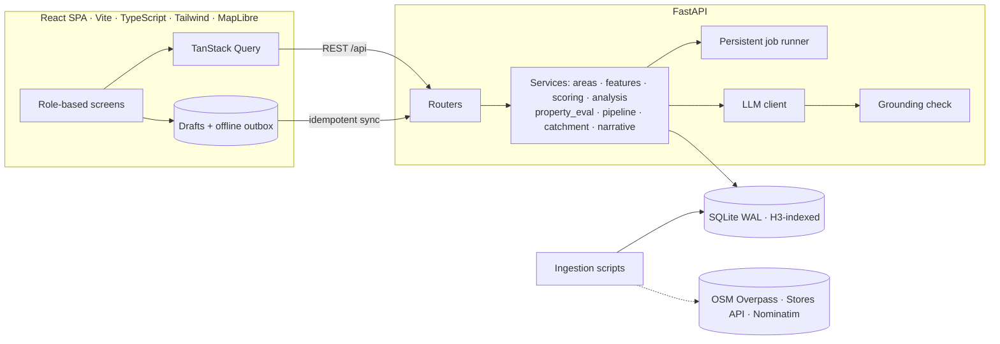
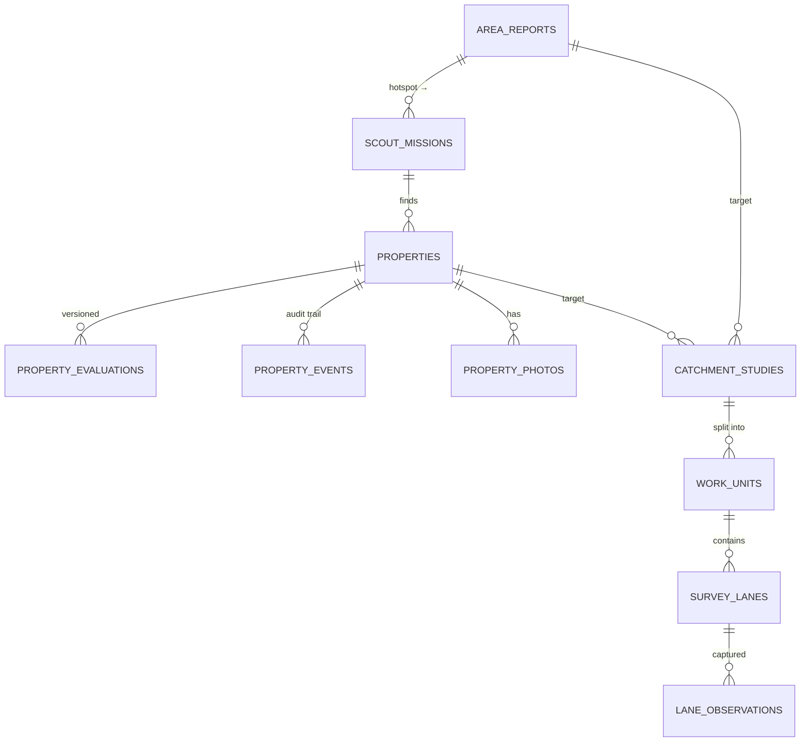

# Savo SiteScout

Expansion intelligence for Savomart Chennai: **which area → which property → is the catchment right**, in one loop shared by BD and survey teams.

- **Video demo:** _TODO: Google Drive link_
- **AI chat sessions:** [`ai-sessions/`](ai-sessions/)

| Persona | Their view |
|---|---|
| **BD Manager** | Map of Chennai with a city-wide opportunity layer → explainable *Area Fitness Report* with "scout here first" hotspots → send executives → 30-second property decision card and pipeline → request catchment studies → grounded AI analyst |
| **BD Executive** (phone) | Missions with navigation → 4-step onboarding: GPS / pin → details → camera photos → duplicate & sanity check. Works offline. |
| **Survey Manager** | Incoming requests → split into fair, non-overlapping sectors → assign → track progress and team workload |
| **Survey Executive** (phone) | Assigned sector on a map → lane-by-lane capture with autosaved drafts and an offline outbox |

---

## 1. Run it locally

Requires **Python 3.11+** and **Node 20+**. No database server and no API keys needed.

```bash
# backend
cd backend
python -m venv .venv
.venv\Scripts\activate              # macOS/Linux: source .venv/bin/activate
pip install -r requirements.txt
python -m scripts.bootstrap         # Chennai data + demo users + demo scenario (~1 min)
uvicorn app.main:app --reload       # API on :8000, docs at /docs

# frontend (second terminal)
cd frontend
npm install
npm run dev                         # open http://localhost:5173
```

**Or with Docker:** `docker compose up --build` → http://localhost:8000 (API and UI in one container).

**Optional:**
- `cp backend/.env.example backend/.env` to add an LLM key (see §6) or the Stores API token.
- `python -m scripts.bootstrap --fresh` resets to the demo state.
- `--live` re-ingests all public data from source.

## 2. Demo credentials

The login page has one-tap persona cards. The password for every account is **`savo@123`**.

| Username | Role |
|---|---|
| `priya` | BD Manager |
| `arun`, `karthik` | BD Executive |
| `lakshmi` | Survey Manager |
| `suresh`, `divya`, `mani` | Survey Executive |

The bootstrap seeds the demo **by calling the real API as each persona**, so every evaluation, audit event and notification in it is genuine. It creates:
- 6 area reports
- 6 scouting missions
- 8 properties spread across every pipeline stage
- 4 catchment studies:
  - **CS-001** completed
  - **CS-002** satisfied entirely by reusing CS-001
  - **CS-003** half-surveyed
  - **CS-004** waiting for the survey manager

**Suggested walkthrough**
1. **priya** → *Explore*: search `Velachery` or `600042`, or tap hexagons in *Grid cells* → *Run virtual analysis*. On the report, *Send an executive* to a hotspot.
2. **arun** → *Missions* → *Add property here* → submit. It is scored automatically within seconds.
3. **priya** → *Pipeline* → open the property → *Shortlist* → *Catchment study* (the preview shows how much is already surveyed).
4. **lakshmi** → CS-004 → *Split into sectors* → assign surveyors.
5. **suresh** → CS-003 → *Next lane to survey* → capture a lane (try it with the network off).
6. **priya** → PR-0001: evaluation v2 is ground-truthed by CS-001 → *Decision pack*. Then *Analyst*: "compare Velachery and Tambaram".

## 3. Architecture



- **Background jobs.** Area analyses and property evaluations run as jobs stored in a `jobs` table with ordered steps. The UI shows a live checklist of those steps. A failed job keeps its error and can be retried, and jobs interrupted by a server restart are re-queued at startup.
- **Access control is enforced on the server.** Every endpoint requires a role, and there are row-level rules on top:
  - executives see only their own missions and properties;
  - surveyors can only write to lanes assigned to them;
  - only managers move pipeline stages.
- **Errors.** Validation problems return 422 with the field named. Domain conflicts return 409 or 422 with plain-English messages. Unexpected 500s never leak stack traces. The UI shows inline errors with a retry, and a per-screen error boundary keeps one broken screen from blanking the app.

## 4. Data model

**Spatial approach.** Every located row stores lat/lng plus **H3** hexagon ids at res 9 (≈0.1 km²) and res 8 (≈0.74 km²). The same grid does three jobs:
- **Spatial index:** a query finds the cells in a ring around a point, then applies an exact distance filter.
- **Map selection:** it is the grid the manager taps to choose an area.
- **Survey coverage:** hexagons never overlap, so "already surveyed" is simple set arithmetic.



| Tables | Notes |
|---|---|
| `pois`, `roads`, `places`, `stores` | Ingested public data. Roads are split into one segment per res-9 cell. |
| `cell_stats`, `opportunity_cells`, `baseline_meta` | Features pre-aggregated per cell, citywide score distributions (used for percentiles), and the opportunity map. |
| `data_snapshots` | One row per ingestion run (source, fetch time, OSM timestamp, row count). This is stamped onto every report and evaluation. |
| `area_reports` | The selected cells, score, pillars, indicators, profile, hotspots, narrative with its AI metadata, data versions, and ground truth. |
| `properties` · `property_evaluations` · `property_events` | Captured details with data-quality warnings and a `client_uuid` for idempotent submits. Evaluations are **versioned**, with the reason each one was triggered. Events are an immutable audit log. |
| `catchment_studies` · `work_units` · `survey_lanes` · `lane_observations` | Requested vs still-to-survey cells, the studies being reused, sectors, lanes, and observations keyed by `client_uuid`. |
| `jobs`, `notifications`, `users` | Background jobs with steps, the activity feed, and seeded users (PBKDF2 password hashes). |

## 5. Data sources

| Source | Used for | Processing |
|---|---|---|
| **OpenStreetMap / Overpass**, snapshot 2026-09-28 | 12,869 points of interest, 113,769 roads, 389,056 buildings, 850 localities | Fetched in tiles over the Chennai metro area, with mirror rotation, retries and an on-disk cache. Points of interest are mapped to a 17-category taxonomy. Roads are densified and split per H3 cell, giving 166k segments. Buildings are reduced to centroids and counted per cell by type. |
| **Savomart Stores API** | 74 stores (11 in Chennai) | Used for proximity, cannibalisation and network fit. A copy is committed in `data/seed/stores.json`. |
| **Nominatim** | 126 pincode centroids, reverse geocoding, locality aliases | Kept to 1 request per second and cached. The OGD pincode API is tried first but timed out during the build. |
| **Census of India 2011** | Population calibration: about 9.0 M people in the study area, 4.0 people per household | Used for the dasymetric estimate in §6. |
| **Mock data** (labelled *MOCK* in the UI) | Rent benchmark in ₹ per sq ft | No open rent data exists for Chennai. |

The processed tables are committed as `backend/data/seed/public_data.sqlite.gz` (about 12 MB), so the setup never depends on the public Overpass servers, which are often overloaded. Map data © OpenStreetMap contributors (ODbL). Basemap tiles: OpenFreeMap.

**Caveats, which the UI also states:**
- OSM under-maps small kirana stores, so mapped competition is a *relative* signal and the survey is the ground truth.
- Building coverage in OSM is patchy, which is why every report carries a data-completeness *confidence* level.

## 6. Scoring and AI

**Population estimate (dasymetric).** The Census total is spread across cells in proportion to two signals, weighted 50/50:
- residential buildings, where buildings of unknown type count 0.7;
- residential street length.

Streets are almost complete in OSM while buildings are not, so blending the two is more robust than either alone. The demo survey CS-001 landed within **1%** of the model's household estimate.

**Area fit.** There are six pillars. Each one is a **percentile against the ~1,470 populated ~1.5 km neighbourhoods of Chennai**, so a 72 means "better than 72% of the city on this dimension".

| Pillar | Weight | Indicators |
|---|---|---|
| Resident demand | 25% | residents per km² |
| Competition gap | 25% | residents per grocery outlet · supermarkets per 10k people (inverted) |
| Daily footfall | 15% | schools, clinics, transit, worship, offices and markets per km² |
| Spending power (proxy) | 10% | banks, eateries and malls per km² · share of apartments |
| Network fit | 15% | distance to the nearest Savomart: under 1 km cannibalises an existing store; 2.5–5 km is the sweet spot |
| Access | 10% | road density · arterial roads |

The report shows the formula `Σ pillar × weight` with the real numbers filled in, plus every indicator with its source. The **confidence** level comes from data completeness, not from the score. Bands: Strong ≥ 70 · Promising ≥ 55 · Marginal ≥ 40 · Weak.

**Hotspots.** Every populated fine cell in the area is scored on its ~750 m walking catchment: `0.35 demand + 0.25 gap + 0.15 footfall + 0.15 road visibility + 0.10 network`. The top 5 are kept, at least 800 m apart, each listed with its reasons.

**Property evaluation.** Four pillars:
- **Catchment, 40%:** public data within 800 m, replaced by survey results once a catchment study covers the property.
- **Site, 25%:** size, frontage, floor, road, parking, power, truck access.
- **Commercials, 20%:** rent vs the benchmark, deposit, lease length.
- **Network, 15%:** distance to the nearest Savomart.

**Deal-breakers** cap the score at 64, so a great catchment can't hide a bad site: a first floor, under 800 sq ft, within 1.5 km of a store, or rent more than 20% over the benchmark. Recommendation: **Go** at 68 or above, **Consider** at 50 or above, otherwise **No-go**.

**Bad field input:**
- Pins outside the Chennai region are rejected.
- Softer problems are shown to the manager as warnings: the pin is more than 250 m from the phone's GPS, poor GPS accuracy, missing rent or area, or a rent per sq ft that looks like the wrong unit.
- Another property within 40 m returns 409 until the executive confirms it's a different unit.
- Offline retries are idempotent.

**Evaluations are versioned.** A new version is created when details are edited, when the manager asks, or when a catchment study completes. The UI shows the change, e.g. `v1: 94 → v2: 84`, and which study ground-truthed it. A property uses its own study first, otherwise the study whose catchment is best centred on it.

**Pipeline stages:**
- `submitted` → `shortlisted` → `site_visit` / `catchment_study` → `negotiation` → `approved`
- `info_requested`: the executive answers by editing, which sends the property back to `submitted`
- `rejected` (needs a reason), `on_hold`, `duplicate`

Every transition needs a note. Only managers move stages.

**How AI is used and kept grounded.** The LLM never computes anything; it only explains a fact sheet produced by the scoring code.
- Every number in its output is checked against that fact sheet, allowing sensible rounding (48,213 → 48k, 0.42 → 42%). **One untraceable number and the narrative is discarded** in favour of a deterministic template.
- The UI always says which one you're reading, e.g. "AI-written · 14 figures verified" or "Template · AI cited figures not in the data".
- The **analyst chat** works the same way: it finds the areas, pincodes, properties and studies named in the question, computes their facts with the same scoring code, and only then lets the LLM phrase the answer.
- The provider is swappable through `.env`: `LLM_PROVIDER=anthropic`, any OpenAI-compatible endpoint (OpenAI, Groq, OpenRouter, Ollama), or `none`. With `none`, which is the default, the app is fully functional with template narratives.
- Scoring, hotspot ranking, survey splitting and reuse decisions deliberately never use AI, so they stay reproducible.

## 7. Catchment studies

- **Reuse.** Earlier survey cells count as covered if their study was completed within **180 days** or is still in progress. If **80% or more** of the new catchment is covered, no fieldwork is created and the new study inherits the results. Otherwise only the uncovered cells are surveyed. Both thresholds are configurable.
- **Fair, non-overlapping split.** Road segments are weighted by length (walking effort), sorted by compass bearing around the centre, and cut into *k* contiguous wedges of equal lane-km. Wedges never overlap and each starts at the centre. The suggested *k* is one per available surveyor, assuming about 4 lane-km per day.
- **Lane capture.** Households, housing type, perceived socio-economic class (SEC A–D), occupancy, kiranas, supermarkets, competitor brands, footfall, vehicle access — or *can't access*. Everything is one-thumb friendly.
- **Weak network.** The assignment is cached on the phone. Drafts autosave after the first edit. Saved lanes go into a local outbox, which syncs on reconnect and every 30 s. The server uses the client UUID as an idempotency key, so a retried send is never double-counted.
- **Roll-up.** When all sectors are done, or the manager closes the study at 60% or more coverage, the results are summarised:
  - households, extrapolated to unsurveyed lanes by length;
  - outlets and households per outlet;
  - SEC and housing mix, competitor brands, footfall;
  - **survey vs model** households.

  The results are linked back to the area report, and the affected properties are re-evaluated.

## 8. Tech choices and trade-offs

| Choice | Why |
|---|---|
| FastAPI + Pydantic, SQLAlchemy 2 | Typed validation and auto-generated OpenAPI docs; a simple job runner fits in-process. |
| **SQLite + H3 + Shapely** instead of PostGIS | Every spatial query here is either "cells in a set" or "within a radius", which H3 rings plus a distance filter answer exactly. It also gives reviewers a one-command setup with no database server. Moving to PostGIS would mean swapping the queries in `services/features.py` for `ST_DWithin`. |
| React + Vite + TypeScript, TanStack Query | Type-safe screens; polling and caching for background jobs. |
| MapLibre GL + OpenFreeMap | Open-source WebGL maps with a keyless vector basemap, smooth with thousands of hexagons. |
| Tailwind v4 | Brand colours (`#782B90`, `#FFF200`) as design tokens, mobile-first. |

Other decisions:
- **Rule-based percentile scoring, not machine learning.** There are no labelled outcomes (store P&L) yet, and managers need to see *why* a score is what it is. These pillars are the features to regress on once that data exists.
- **Approximate pincode and locality boundaries.** Each area is the set of grid cells nearest to its pincode or locality centre (a discrete Voronoi split, capped by radius). This is labelled in the UI.
- **Polling instead of websockets** for job progress, which is more robust on flaky mobile networks.
- **Simple auth.** Seeded users, HMAC-signed tokens and a demo persona switcher, as the brief allows. Role checks are real and happen on the server.

## 9. Known issues and next steps

- The rent benchmark is mock data. Next step: plug in real lease comparables.
- Population is calibrated to a single 2011 total. Next step: calibrate per ward with newer estimates.
- Pincode areas are Voronoi approximations. Next step: use the official OGD boundary GeoJSON.
- There is no service worker yet. Assignments and drafts work offline, but the app itself needs one online load first.
- Survey sectors are compass wedges. Very elongated catchments would split better along the street network itself.
- The job runner is single-instance with no rate limiting; fine for a team, not for scale.
- Catchments are straight-line radii. Next step: drive-time catchments via OSRM.

## 10. Tests and CI

```bash
cd backend && python -m pytest -q     # 14 tests
cd frontend && npm run build          # type-check + production build
```

- **Unit tests** cover: scoring is monotonic and exactly the weighted sum of its pillars; the network sweet spot; AI grounding accepts roundings and rejects invented numbers; the survey split is a balanced, contiguous partition.
- **The flow test** runs the full **M1 → M2 → M3 loop through the API** on a synthetic city. It checks:
  - role enforcement and the background job;
  - bad-pin rejection, data-quality warnings, idempotent resubmits and the 409 duplicate;
  - pipeline rules;
  - survey split and cross-surveyor write rejection;
  - harmless offline re-sync and automatic roll-up;
  - ground-truthed re-evaluation and full reuse.
- **GitHub Actions** runs the tests, a full `bootstrap --fresh`, and the frontend build.

## 11. How AI tools were used

Built with **Claude Code** (Anthropic) in the Claude desktop app. The full transcript is in [`ai-sessions/`](ai-sessions/). It was used to:
- probe the data sources;
- design and implement the backend, frontend and tests;
- click through every persona in a browser to find and fix bugs, for example an unbalanced survey split, a property ground-truthed by the wrong study, and a map sizing issue.

_TODO (author): add a line on how you directed and reviewed the work._

## 12. Project layout

```
backend/
  app/            main · config · db · models · geo · auth
    services/     areas · features · scoring · analysis · property_eval · pipeline · catchment · narrative · jobs
    routers/      core · reports · properties · studies · assistant
    llm/          provider client · grounding check
  scripts/        bootstrap · ingest_* · build_baseline · snapshot · demo_scenario
  data/seed/      committed public-data snapshot
  tests/
frontend/src/
  pages/          Explore · ReportDetail · Pipeline · PropertyDetail · NewProperty · StudyDetail · SurveyUnit · Assistant …
  components/     Map · Layout · Modals · PropertyFields · ui
  lib/            api · auth · offline (drafts, outbox, photo compression)
ai-sessions/      AI session transcript
```

_Windows note: if pip-installed SQLAlchemy is blocked by Smart App Control ("Application Control policy has blocked this file"), install its pure-Python wheel instead: `pip download sqlalchemy --only-binary=:all: --platform any --no-deps -d w && pip install --force-reinstall --no-deps w/*.whl`._
